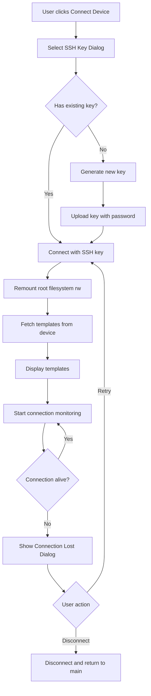
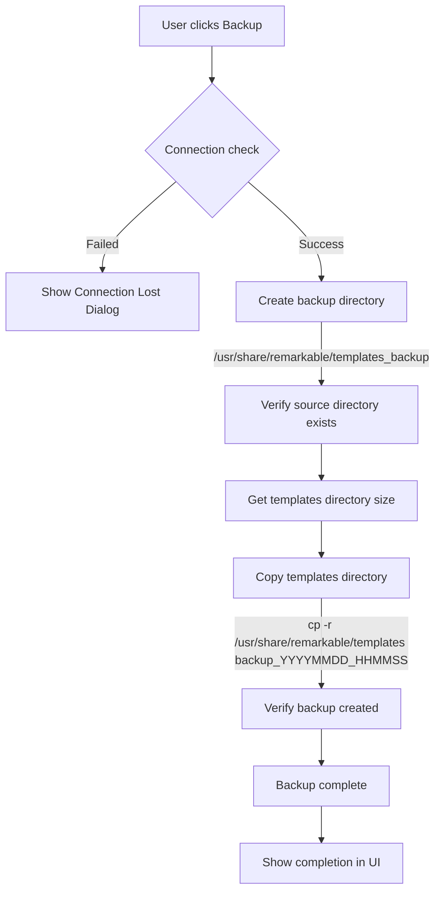
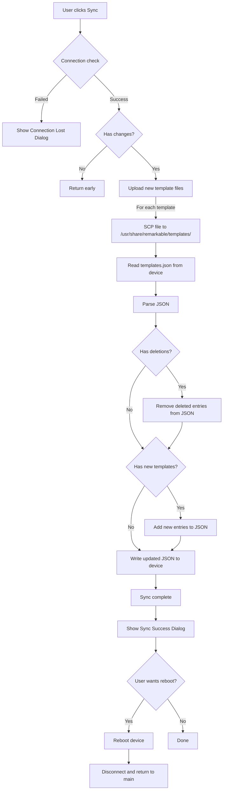
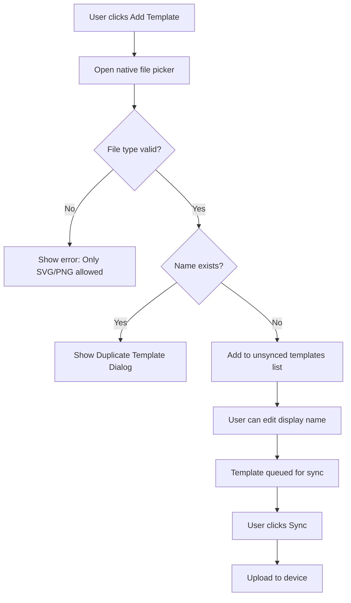

# Remarkable Template Manager

A desktop application for managing templates on your reMarkable device, built with [Wails](https://wails.io/) (Go + React). Upload, delete, and organize templates with an intuitive interface.

## Features

### Connection Management
- **SSH Key Authentication**: Connect using existing SSH keys from `~/.ssh`
- **SSH Key Generation**: Generate new RSA keys for device access (format: `remarkable_<random_id>`)
- **SSH Key Upload**: Automatically upload public keys to device using password authentication
- **Auto-Remount**: Automatically remounts root filesystem as read-write after connection
- **Connection Health Monitoring**: Periodic connection checks (every 10 seconds) with automatic reconnection
- **Connection Lost Dialog**: Notifications when connection is lost with retry/disconnect options
- **Connection Validation**: Checks connection status before backup/sync operations

### Template Management
- **View Templates**: Browse all templates from your reMarkable device
- **Upload Templates**: Add new SVG or PNG templates via native file picker
- **Edit Template Names**: Rename templates before syncing (display name only, filename unchanged)
- **Delete Templates**: Select and queue templates for deletion
- **Sync to Device**: Upload new templates and apply deletions in one operation
- **Template Backup**: Create timestamped backups of all templates on device
- **Duplicate Detection**: Prevents uploading templates with duplicate names
- **File Type Validation**: Only allows SVG and PNG files
- **Filename Validation**: Ensures filenames don't contain spaces or special characters (except `-` and `_`)

### User Interface
- **Modern Design**: Clean, responsive UI built with Tailwind CSS and shadcn/ui
- **Version Display**: Application version shown in top-right header (build-time configurable)
- **Support Link**: Quick access to support the project with QR code donation link
- **Progress Indicators**: Visual feedback during sync, backup, and upload operations
- **Animated Transitions**: Smooth animations using Framer Motion
- **Template Organization**: 
  - Unsynced templates shown at top with editable names
  - Synced templates on device shown below
  - Pending deletions shown separately with visual indicators
- **Connection Status**: Real-time connection status indicator (green when connected)
- **Reboot Prompt**: Option to reboot device after sync to apply changes

## Screenshots

### Getting Started

**1. Launch Screen**

The main screen when the app first opens, showing the option to connect to your reMarkable device.

**2. Select Login Method**

Connection method selection (SSH key authentication is the only option).

**3. Select SSH Key**

Select an existing SSH key from your `~/.ssh` directory or generate a new one.

**4. Upload SSH Key**

For new SSH keys, enter your device IP address and password to upload the public key.

**5. Select Existing SSH Key**

If you already have an SSH key configured on your device, simply select it and connect.

### Template Management

**6. Templates View**

Browse all templates from your reMarkable device. Unsynced templates appear at the top with editable names, while synced templates are shown below.

**7. Add Template**

Add new templates by selecting SVG or PNG files. Edit the display name before syncing to your device.

**8. Remove Template**

Select templates to delete. They'll be marked for deletion and removed during the next sync operation.

## Project Structure

```
remarkable-template-manager/
├── app.go                   # App struct, lifecycle, version
├── main.go                  # Go entry point - Wails app configuration
├── types.go                 # Type definitions (SSHKey, DeviceTemplate, etc.)
├── ssh.go                   # SSH connection and key management
├── templates.go             # Template fetch, sync, and backup operations
├── files.go                 # File selection and SCP upload
├── device.go                # Device operations (reboot)
├── wails.json               # Wails project configuration
├── go.mod                   # Go module dependencies
├── go.sum
├── LICENSE
├── screens/                 # Application screenshots
│   ├── 1. launch.png
│   ├── 2. select-login.png
│   ├── 3. select-ssh.png
│   ├── 4. upload-ssh.png
│   ├── 5. select-existing-ssh.png
│   ├── 6. templates.png
│   ├── 7. add-template.png
│   └── 8. remove-template.png
├── build/                   # Build assets and platform configs
│   ├── appicon.png
│   ├── darwin/              # macOS specific configs
│   └── windows/             # Windows specific configs
└── frontend/                # React + TypeScript frontend
    ├── index.html
    ├── package.json
    ├── vite.config.ts
    ├── tailwind.config.ts
    ├── tsconfig.json
    ├── public/              # Static assets
    │   └── support-qr.png
    ├── src/
    │   ├── main.tsx         # React entry point
    │   ├── App.tsx          # Main app component
    │   ├── index.css        # Global styles with Tailwind
    │   ├── assets/          # Image assets
    │   │   └── support-qr.png
    │   ├── pages/
    │   │   ├── Index.tsx    # Main page with device connection UI
    │   │   └── NotFound.tsx
    │   ├── components/
    │   │   ├── RemarkableDevice.tsx
    │   │   ├── ConnectionMethodDialog.tsx
    │   │   ├── PasswordConnectionDialog.tsx
    │   │   ├── SSHKeySelectionDialog.tsx
    │   │   ├── ConnectionLostDialog.tsx
    │   │   ├── DuplicateTemplateDialog.tsx
    │   │   ├── InvalidFilenameDialog.tsx
    │   │   ├── ErrorDialog.tsx        # Reusable error dialog component
    │   │   ├── InfoDialog.tsx         # Reusable info/success dialog component
    │   │   ├── SyncSuccessDialog.tsx
    │   │   ├── SupportDialog.tsx
    │   │   ├── TemplateList.tsx
    │   │   └── ui/          # shadcn/ui components
    │   ├── hooks/
    │   │   ├── use-mobile.tsx
    │   │   └── use-toast.ts
    │   ├── lib/
    │   │   ├── utils.ts              # Tailwind class utilities
    │   │   └── template-utils.ts      # Template mapping and file utilities
    │   └── test/            # Frontend tests
    └── wailsjs/             # Wails Go bindings (auto-generated)
        ├── go/main/         # Go method bindings
        └── runtime/         # Wails runtime API
```

## Prerequisites

- [Go](https://golang.org/dl/) 1.21+
- [Node.js](https://nodejs.org/) 18+
- [Wails CLI](https://wails.io/docs/gettingstarted/installation)

Install Wails CLI:
```bash
go install github.com/wailsapp/wails/v2/cmd/wails@latest
```

## Development

1. **Install dependencies**:
   ```bash
   cd frontend
   npm install
   cd ..
   ```

2. **Run in development mode**:
   ```bash
   wails dev
   ```

3. **Generate Wails bindings** (after adding new Go methods):
   ```bash
   wails generate module
   ```

## Building

### Development Build

```bash
wails dev
```
Version will display as "dev" in development mode.

### Production Build

Build a production binary:

```bash
wails build
```
Version will display as "dev" if not specified.

### Building with Version

To build with a specific version:

```bash
wails build -ldflags "-X main.Version=v1.0.0"
```

The version will be displayed in the top-right corner of the application header.

The output binary will be in `build/bin/`.

## Usage

### Connecting to Your Device

1. Click "Connect Device" on the main screen
2. Select an SSH key from `~/.ssh` or generate a new one
3. If using a new SSH key:
   - Enter device IP address (default: `10.11.99.1`)
   - Enter device password to upload the public key
4. The app will automatically:
   - Remount the root filesystem as read-write
   - Fetch and display templates from your device

### Adding Templates

1. Click "Add new template..." in the template list
2. Select an SVG or PNG file using the native file picker
3. Edit the template name if desired (this is the display name, not the filename)
4. Click "Sync" to upload to device
5. Optionally reboot the device to see changes immediately

### Deleting Templates

1. Check the boxes next to templates you want to delete
2. Click "Delete" button
3. Templates will be marked for deletion
4. Click "Sync" to apply deletions (removes from `templates.json`)
5. Optionally reboot the device

### Backing Up Templates

1. Click "Backup" button
2. A timestamped backup will be created at `/usr/share/remarkable/templates_backup/backup_YYYYMMDD_HHMMSS/`
3. Progress indicator shows backup status

## Backend API

The Go backend provides the following methods (exposed via Wails):

### Connection Management
- `ListSSHKeys()` - List SSH keys from `~/.ssh`
- `GenerateSSHKey()` - Generate new RSA key pair (4096-bit, no passphrase)
- `ConnectSSH(keyPath, ip)` - Connect via SSH key and remount filesystem (remount happens automatically)
- `UploadSSHKey(keyPath, ip, password)` - Upload public key to device's `authorized_keys`
- `DisconnectSSH()` - Close SSH connection
- `IsConnected()` - Check connection status
- `CheckConnection()` - Test if connection is alive (runs `echo ok`)

### Template Management
- `FetchTemplates()` - Get templates from device's `templates.json`
- `SelectTemplateFile()` - Open native file picker for SVG/PNG selection
- `BackupTemplates()` - Create timestamped backup of templates directory
- `SyncTemplates(templates, deletions)` - Upload new templates and update `templates.json`
- `RebootDevice()` - Reboot the reMarkable device

### Application Info
- `GetVersion()` - Get application version (set at build time)

## Tech Stack

- **Backend**: Go with Wails v2
- **Frontend**: React 18 + TypeScript
- **Styling**: Tailwind CSS + shadcn/ui components
- **Build Tool**: Vite
- **Animations**: Framer Motion
- **SSH**: golang.org/x/crypto/ssh

### Code Organization

The codebase follows a modular structure with reusable components and utilities:

- **Reusable Dialog Components**: `ErrorDialog` and `InfoDialog` provide consistent UI patterns for error and success messages
- **Utility Functions**: `template-utils.ts` contains shared logic for template mapping and file operations
- **Component Composition**: Specific dialogs (e.g., `DuplicateTemplateDialog`, `InvalidFilenameDialog`) wrap reusable base components for maintainability

## File Formats

### Template Specifications

Templates are **PNG or SVG files** with specific dimensions depending on your device:

- **reMarkable 1 & 2**: `1404 x 1872` pixels
- **reMarkable Pro**: `1620 x 2160` pixels

**Filename Requirements:**
- Template filenames (without extension) **cannot contain spaces or special characters**
- Only allowed characters: letters (a-z, A-Z), numbers (0-9), hyphens (`-`), and underscores (`_`)
- Examples of valid filenames: `my-template`, `template_01`, `MyTemplate123`
- Examples of invalid filenames: `my template.png` (space), `template@1.png` (special character), `template#2.png` (special character)

**Template Resources:**
- [Figma Template Collection](https://www.figma.com/design/zFCgryzevZXomUjC7ClCoP/Remarkable-Templates?node-id=0-1&t=oBWgloozt8RyA0LU-1) - Includes 2 pre-sized templates ready to use

### Storage Locations

- **Template Storage**: `/usr/share/remarkable/templates/` on device
- **Template Metadata**: `/usr/share/remarkable/templates/templates.json`
- **Backup Location**: `/usr/share/remarkable/templates_backup/backup_YYYYMMDD_HHMMSS/`

## Workflow Diagrams

### Connection Flow



### Backup Flow



### Sync Flow



### Template Upload Flow



## Notes

- **Template Changes**: Changes require a device reboot to be visible in the reMarkable UI
- **Connection Monitoring**: The app automatically checks connection health every 10 seconds
- **SSH Keys**: Stored in `~/.ssh` following standard naming conventions
- **Generated Keys**: Format `remarkable_<random_id>` (16-character hex ID)
- **File Deletion**: Template files are not physically deleted from device, only removed from `templates.json`
- **Filesystem Access**: Root filesystem is automatically remounted as read-write after connection
- **Version Management**: Version is set at build time using `-ldflags "-X main.Version=v1.0.0"`
- **Backup Location**: Backups are stored in `/usr/share/remarkable/templates_backup/backup_YYYYMMDD_HHMMSS/` on the reMarkable device

## ⚠️ Important Information

### Platform Compatibility

**This application has been tested on macOS only.** While it should work on Windows and Linux (as Wails supports these platforms), it has not been thoroughly tested on these systems. 

**Pre-built binaries are only provided for macOS.** For Windows and Linux, you'll need to build the application yourself using the instructions in the [Building](#building) section above. If you're using Windows or Linux and encounter issues during build or usage, please reach out - your feedback and testing would be greatly appreciated!

### ⚠️ Disclaimer & Warning

**USE THIS SOFTWARE AT YOUR OWN RISK. THE DEVELOPER IS NOT RESPONSIBLE FOR ANY DAMAGE TO YOUR DEVICE, DATA LOSS, OR ANY OTHER ISSUES THAT MAY ARISE FROM USING THIS APPLICATION.**

While this application is designed to be safe to use (you don't need to root your device), there are inherent risks when modifying system files on your reMarkable device. Always ensure you have proper backups before making any changes.

### reMarkable Pro Users - Developer Mode Required

**Important:** For reMarkable Pro devices, Developer Mode must be enabled to use this application. 

⚠️ **WARNING:** Enabling Developer Mode will **reset your device to factory settings**, which means:
- All your notes and files will be deleted
- All settings will be reset
- You will lose all local data on the device

**Before enabling Developer Mode:**
- If you have **reMarkable Connect** (cloud sync), your notes will be synced and can be restored after the reset
- If you **do NOT** have reMarkable Connect, you **MUST manually backup your notes first** using other methods (USB transfer, etc.)
- Consider the implications carefully - you will lose all local data

The app is generally safe to use once Developer Mode is enabled, but always maintain backups of important data.

## License

See [LICENSE](LICENSE) file.
