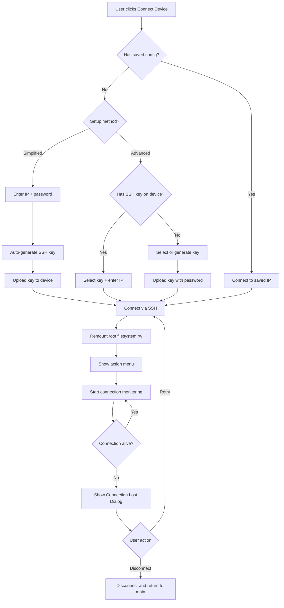
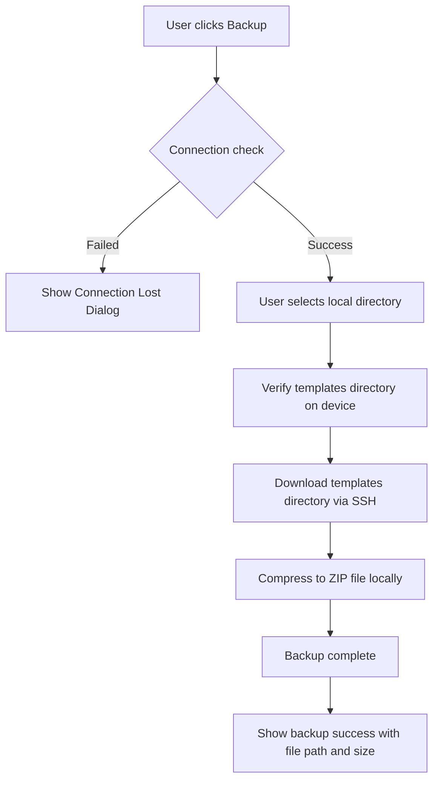
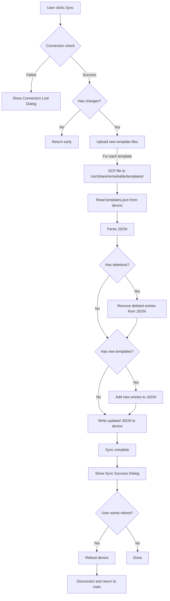
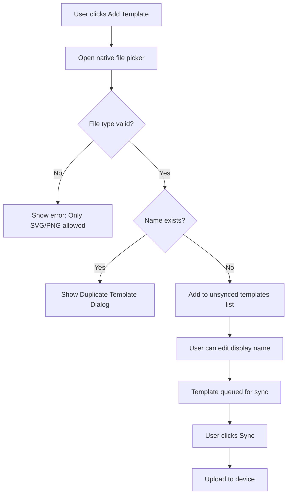

# Remarkable Template Manager

A desktop application for managing templates on your reMarkable device, built with [Wails](https://wails.io/) (Go + React). Upload, delete, and organize templates with an intuitive interface.

## Features

### Connection Management
- **Simplified Setup**: Quick connection with just IP address and password — auto-generates and uploads an SSH key
- **Advanced Setup**: Full SSH key configuration for technical users (select existing or generate new keys)
- **Saved Configuration**: Reconnect to a previously configured device with one click, or connect to a different device
- **SSH Key Authentication**: Connect using existing SSH keys from `~/.ssh`
- **SSH Key Generation**: Generate new RSA keys for device access (format: `remarkable_<random_id>`)
- **SSH Key Upload**: Automatically upload public keys to device using password authentication
- **Auto-Remount**: Automatically remounts root filesystem as read-write after connection
- **Connection Health Monitoring**: Periodic connection checks (every 10 seconds) with automatic reconnection
- **Connection Lost Dialog**: Notifications when connection is lost with retry/disconnect options
- **Connection Validation**: Checks connection status before backup/sync operations

### Template Management
- **View Templates**: Browse all templates from your reMarkable device
- **Upload Templates**: Add new SVG or PNG templates via native file picker
- **Edit Template Names**: Rename templates before syncing (display name only, filename unchanged)
- **Delete Templates**: Select and queue templates for deletion
- **Sync to Device**: Upload new templates and apply deletions in one operation
- **Template Backup**: Create timestamped backups of all templates on device
- **Duplicate Detection**: Prevents uploading templates with duplicate names
- **File Type Validation**: Only allows SVG and PNG files
- **Filename Validation**: Ensures filenames don't contain spaces or special characters (except `-` and `_`)

### User Interface
- **Modern Design**: Clean, responsive UI built with Tailwind CSS and shadcn/ui
- **Version Display**: Application version shown in top-right header (build-time configurable)
- **Support Link**: Quick access to support the project with QR code donation link
- **Progress Indicators**: Visual feedback during sync, backup, and upload operations
- **Animated Transitions**: Smooth animations using Framer Motion
- **Template Organization**: 
  - Unsynced templates shown at top with editable names
  - Synced templates on device shown below
  - Pending deletions shown separately with visual indicators
- **Connection Status**: Real-time connection status indicator (green when connected)
- **Reboot Prompt**: Option to reboot device after sync to apply changes

## Screenshots

### Getting Started

**1. Launch Screen**

The main screen when the app first opens, showing the "Connect Device" button.

**2. Select Setup Method**

Choose between "Simplified Setup" (recommended) for a quick connection or "Advanced Setup" for full SSH key configuration.

**3. Simplified Setup**

Quick setup — just enter your device IP address and password. The app auto-generates an SSH key and connects.

**4. Advanced Setup**

Advanced setup for technical users — choose whether you already have an SSH key on the device or need to upload one.

**5. Select SSH Key to Upload**

Choose an existing SSH key from `~/.ssh` to upload, or generate a new one.

**6. Select Existing SSH Key**

Enter device IP and select an SSH key already configured on the device to connect.

### Connected

**7. Action Menu**

Post-connection menu with options for Backup, Restore, and Manage Templates.

**8. Template Management**

Browse all templates on your device. Unsynced templates appear at the top with editable names, synced templates are shown below with landscape indicators.

### Reconnecting

**9. Saved Configuration**

Reconnect to a previously configured device with one click, or use "Different Device" / "Clear Saved" to start fresh.

## Project Structure

```
remarkable-template-manager/
├── app.go                   # App struct, lifecycle, version, config methods
├── main.go                  # Go entry point - Wails app configuration
├── types.go                 # Type definitions (SSHKey, DeviceTemplate, etc.)
├── config.go                # Persistent configuration management
├── ssh.go                   # SSH connection and key management
├── templates.go             # Template fetch, sync, backup, and restore
├── files.go                 # File selection, SCP upload, ZIP compress/extract
├── device.go                # Device operations (reboot)
├── wails.json               # Wails project configuration
├── go.mod                   # Go module dependencies
├── go.sum
├── LICENSE
├── docs/                    # Detailed documentation
│   ├── architecture.md
│   ├── configuration.md
│   └── device-integration.md
├── screens/                 # Application screenshots
├── build/                   # Build assets and platform configs
│   ├── appicon.png
│   ├── darwin/              # macOS specific configs
│   └── windows/             # Windows specific configs
└── frontend/                # React + TypeScript frontend
    ├── index.html
    ├── package.json
    ├── vite.config.ts
    ├── tailwind.config.ts
    ├── tsconfig.json
    ├── src/
    │   ├── main.tsx         # React entry point
    │   ├── App.tsx          # Main app component
    │   ├── index.css        # Global styles with Tailwind
    │   ├── pages/
    │   │   ├── Index.tsx    # Main page - connection flow & template management
    │   │   └── NotFound.tsx
    │   ├── components/
    │   │   ├── ActionMenu.tsx             # Post-connection action menu
    │   │   ├── RemarkableDevice.tsx       # Device display with connection status
    │   │   ├── TemplateList.tsx           # Template browse, upload, delete
    │   │   ├── SetupChoiceDialog.tsx      # SSH vs simplified setup selection
    │   │   ├── SSHKeySelectionDialog.tsx  # SSH key selection/generation
    │   │   ├── SimplifiedSetupDialog.tsx  # Quick setup with IP + password
    │   │   ├── ConnectionMethodDialog.tsx # Connection method selection
    │   │   ├── PasswordConnectionDialog.tsx
    │   │   ├── ConnectionLostDialog.tsx
    │   │   ├── ErrorDialog.tsx            # Reusable error dialog
    │   │   ├── InfoDialog.tsx             # Reusable info/success dialog
    │   │   ├── DuplicateTemplateDialog.tsx
    │   │   ├── InvalidFilenameDialog.tsx
    │   │   ├── SyncSuccessDialog.tsx
    │   │   ├── BackupSuccessDialog.tsx
    │   │   ├── RestoreSuccessDialog.tsx
    │   │   ├── SupportDialog.tsx
    │   │   └── ui/                        # shadcn/ui components
    │   ├── hooks/
    │   │   ├── use-mobile.tsx
    │   │   └── use-toast.ts
    │   ├── lib/
    │   │   ├── utils.ts              # Tailwind class utilities
    │   │   └── template-utils.ts     # Template mapping and file utilities
    │   └── test/            # Frontend tests
    └── wailsjs/             # Wails Go bindings (auto-generated, do not edit)
        ├── go/main/         # Go method bindings
        └── runtime/         # Wails runtime API
```

## Prerequisites

- [Go](https://golang.org/dl/) 1.21+
- [Node.js](https://nodejs.org/) 18+
- [Wails CLI](https://wails.io/docs/gettingstarted/installation)

Install Wails CLI:
```bash
go install github.com/wailsapp/wails/v2/cmd/wails@latest
```

## Development

1. **Install dependencies**:
   ```bash
   cd frontend
   npm install
   cd ..
   ```

2. **Run in development mode**:
   ```bash
   wails dev
   ```

3. **Generate Wails bindings** (after adding new Go methods):
   ```bash
   wails generate module
   ```

## Building

### Development Build

```bash
wails dev
```
Version will display as "dev" in development mode.

### Production Build

Build a production binary:

```bash
wails build
```
Version will display as "dev" if not specified.

### Building with Version

To build with a specific version:

```bash
wails build -ldflags "-X main.Version=v1.0.0"
```

The version will be displayed in the top-right corner of the application header.

The output binary will be in `build/bin/`.

## Usage

### Connecting to Your Device

1. Click "Connect Device" on the main screen
2. Choose a setup method:
   - **Simplified Setup** (recommended): Enter your device IP address and password — the app auto-generates an SSH key, uploads it, and connects
   - **Advanced Setup**: Choose whether you already have an SSH key on the device or need to upload one, then select or generate a key and connect
3. After connecting, the action menu appears with options for **Backup**, **Restore**, or **Manage Templates**
4. On subsequent launches, use "Connect to [IP]" to reconnect with your saved configuration, or choose "Different Device" / "Clear Saved" to start fresh

### Adding Templates

1. Click "Add new template..." in the template list
2. Select an SVG or PNG file using the native file picker
3. Edit the template name if desired (this is the display name, not the filename)
4. Click "Sync" to upload to device
5. Optionally reboot the device to see changes immediately

### Deleting Templates

1. Check the boxes next to templates you want to delete
2. Click "Delete" button
3. Templates will be marked for deletion
4. Click "Sync" to apply deletions (removes from `templates.json`)
5. Optionally reboot the device

### Backing Up Templates

1. Click "Backup" in the action menu
2. Select a directory on your computer to save the backup
3. Templates are downloaded from the device and saved as a ZIP file (`remarkable-templates-backup-YYYYMMDD-HHMMSS.zip`)
4. The last used backup directory is remembered for convenience

### Restoring Templates

1. Click "Restore" in the action menu
2. Select a backup ZIP file from your computer
3. The current templates on the device are renamed as a safety backup
4. The backup contents are uploaded to the device
5. Reboot the device to see restored templates

## Backend API

The Go backend provides the following methods (exposed via Wails):

### Connection Management
- `ListSSHKeys()` - List SSH keys from `~/.ssh`
- `GenerateSSHKey()` - Generate new RSA key pair (4096-bit, no passphrase)
- `ConnectSSH(keyPath, ip)` - Connect via SSH key and remount filesystem (remount happens automatically)
- `UploadSSHKey(keyPath, ip, password)` - Upload public key to device's `authorized_keys`
- `DisconnectSSH()` - Close SSH connection
- `IsConnected()` - Check connection status
- `CheckConnection()` - Test if connection is alive (runs `echo ok`)

### Template Management
- `FetchTemplates()` - Get templates from device's `templates.json`
- `SelectTemplateFile()` - Open native file picker for SVG/PNG selection
- `SyncTemplates(templates, deletions)` - Upload new templates and update `templates.json`
- `RebootDevice()` - Reboot the reMarkable device

### Backup & Restore
- `BackupTemplates(targetDir)` - Download templates from device and save as local ZIP
- `RestoreTemplates(backupFilePath)` - Restore templates from a backup ZIP to device
- `SelectBackupDirectory()` - Open native directory picker for backup location
- `SelectBackupFile()` - Open native file picker for backup ZIP selection

### Configuration
- `LoadConfig()` - Load saved connection configuration
- `SaveConfig(ip, sshKeyPath)` - Save connection details
- `SaveLastBackupDirectory(dir)` - Persist last backup directory
- `GetLastBackupDirectory()` - Get last backup directory
- `DeleteConfig()` - Remove saved configuration
- `GetConfigPath()` - Get config file path

### Application Info
- `GetVersion()` - Get application version (set at build time)

## Tech Stack

- **Backend**: Go with Wails v2
- **Frontend**: React 18 + TypeScript
- **Styling**: Tailwind CSS + shadcn/ui components
- **Build Tool**: Vite
- **Animations**: Framer Motion
- **SSH**: golang.org/x/crypto/ssh

## Documentation

Detailed documentation is available in the [`docs/`](docs/) directory:

- **[Architecture](docs/architecture.md)** — Backend modules, frontend structure, data flow
- **[Device Integration](docs/device-integration.md)** — SSH connection, filesystem layout, template format
- **[Configuration](docs/configuration.md)** — Persistent config storage, file format, platform paths

## File Formats

### Template Specifications

Templates are **PNG or SVG files** with specific dimensions depending on your device:

- **reMarkable 1 & 2**: `1404 x 1872` pixels
- **reMarkable Pro**: `1620 x 2160` pixels

**Filename Requirements:**
- Template filenames (without extension) **cannot contain spaces or special characters**
- Only allowed characters: letters (a-z, A-Z), numbers (0-9), hyphens (`-`), and underscores (`_`)
- Examples of valid filenames: `my-template`, `template_01`, `MyTemplate123`
- Examples of invalid filenames: `my template.png` (space), `template@1.png` (special character), `template#2.png` (special character)

**Template Resources:**
- [Figma Template Collection](https://www.figma.com/design/zFCgryzevZXomUjC7ClCoP/Remarkable-Templates?node-id=0-1&t=oBWgloozt8RyA0LU-1) - Includes 2 pre-sized templates ready to use

### Storage Locations

- **Template Storage**: `/usr/share/remarkable/templates/` on device
- **Template Metadata**: `/usr/share/remarkable/templates/templates.json`
- **Backup Location**: Local ZIP file saved to user-selected directory

## Workflow Diagrams

### Connection Flow


```mermaid
flowchart TD
    Start[User clicks Connect Device] --> HasConfig{Has saved config?}
    HasConfig -->|Yes| Reconnect[Connect to saved IP]
    HasConfig -->|No| SetupChoice{Setup method?}
    SetupChoice -->|Simplified| EnterCreds[Enter IP + password]
    EnterCreds --> AutoGen[Auto-generate SSH key]
    AutoGen --> UploadKey[Upload key to device]
    UploadKey --> Connect[Connect via SSH]
    SetupChoice -->|Advanced| HasSSHKey{Has SSH key on device?}
    HasSSHKey -->|Yes| SelectKey[Select key + enter IP]
    SelectKey --> Connect
    HasSSHKey -->|No| PickKey[Select or generate key]
    PickKey --> UploadAdv[Upload key with password]
    UploadAdv --> Connect
    Reconnect --> Connect
    Connect --> Remount[Remount root filesystem rw]
    Remount --> ActionMenu[Show action menu]
    ActionMenu --> Monitor[Start connection monitoring]
    Monitor --> Check{Connection alive?}
    Check -->|Yes| Monitor
    Check -->|No| ShowDialog[Show Connection Lost Dialog]
    ShowDialog --> Retry{User action}
    Retry -->|Retry| Connect
    Retry -->|Disconnect| Disconnect[Disconnect and return to main]
```

### Backup Flow


```mermaid
flowchart TD
    Start[User clicks Backup] --> CheckConn{Connection check}
    CheckConn -->|Failed| ShowError[Show Connection Lost Dialog]
    CheckConn -->|Success| SelectDir[User selects local directory]
    SelectDir --> VerifySource[Verify templates directory on device]
    VerifySource --> Download[Download templates directory via SSH]
    Download --> Compress[Compress to ZIP file locally]
    Compress --> Success[Backup complete]
    Success --> ShowDialog[Show backup success with file path and size]
```

### Sync Flow


```mermaid
flowchart TD
    Start[User clicks Sync] --> CheckConn{Connection check}
    CheckConn -->|Failed| ShowError[Show Connection Lost Dialog]
    CheckConn -->|Success| HasChanges{Has changes?}
    HasChanges -->|No| Return[Return early]
    HasChanges -->|Yes| UploadFiles[Upload new template files]
    UploadFiles -->|For each template| SCPUpload[SCP file to /usr/share/remarkable/templates/]
    SCPUpload --> ReadJSON[Read templates.json from device]
    ReadJSON --> ParseJSON[Parse JSON]
    ParseJSON --> RemoveDeleted{Has deletions?}
    RemoveDeleted -->|Yes| FilterJSON[Remove deleted entries from JSON]
    RemoveDeleted -->|No| AddNew
    FilterJSON --> AddNew{Has new templates?}
    AddNew -->|Yes| AddEntries[Add new entries to JSON]
    AddNew -->|No| WriteJSON
    AddEntries --> WriteJSON[Write updated JSON to device]
    WriteJSON --> Success[Sync complete]
    Success --> ShowDialog[Show Sync Success Dialog]
    ShowDialog --> RebootPrompt{User wants reboot?}
    RebootPrompt -->|Yes| Reboot[Reboot device]
    RebootPrompt -->|No| Done[Done]
    Reboot --> Disconnect[Disconnect and return to main]
```

### Template Upload Flow


```mermaid
flowchart TD
    Start[User clicks Add Template] --> FileDialog[Open native file picker]
    FileDialog --> Validate{File type valid?}
    Validate -->|No| ShowError[Show error: Only SVG/PNG allowed]
    Validate -->|Yes| CheckDuplicate{Name exists?}
    CheckDuplicate -->|Yes| ShowDuplicate[Show Duplicate Template Dialog]
    CheckDuplicate -->|No| AddToList[Add to unsynced templates list]
    AddToList --> EditName[User can edit display name]
    EditName --> QueueSync[Template queued for sync]
    QueueSync --> Sync[User clicks Sync]
    Sync --> Upload[Upload to device]
```

## Notes

- **Template Changes**: Changes require a device reboot to be visible in the reMarkable UI
- **Connection Monitoring**: The app automatically checks connection health every 10 seconds
- **SSH Keys**: Stored in `~/.ssh` following standard naming conventions
- **Generated Keys**: Format `remarkable_<random_id>` (16-character hex ID)
- **File Deletion**: Template files are not physically deleted from device, only removed from `templates.json`
- **Filesystem Access**: Root filesystem is automatically remounted as read-write after connection
- **Version Management**: Version is set at build time using `-ldflags "-X main.Version=v1.0.0"`
- **Backup Location**: Backups are saved locally as ZIP files (`remarkable-templates-backup-YYYYMMDD-HHMMSS.zip`)

## ⚠️ Important Information

### Platform Compatibility

**This application has been tested on macOS only.** While it should work on Windows and Linux (as Wails supports these platforms), it has not been thoroughly tested on these systems. 

**Pre-built binaries are only provided for macOS.** For Windows and Linux, you'll need to build the application yourself using the instructions in the [Building](#building) section above. If you're using Windows or Linux and encounter issues during build or usage, please reach out - your feedback and testing would be greatly appreciated!

### ⚠️ Disclaimer & Warning

**USE THIS SOFTWARE AT YOUR OWN RISK. THE DEVELOPER IS NOT RESPONSIBLE FOR ANY DAMAGE TO YOUR DEVICE, DATA LOSS, OR ANY OTHER ISSUES THAT MAY ARISE FROM USING THIS APPLICATION.**

While this application is designed to be safe to use (you don't need to root your device), there are inherent risks when modifying system files on your reMarkable device. Always ensure you have proper backups before making any changes.

### reMarkable Pro Users - Developer Mode Required

**Important:** For reMarkable Pro devices, Developer Mode must be enabled to use this application. 

⚠️ **WARNING:** Enabling Developer Mode will **reset your device to factory settings**, which means:
- All your notes and files will be deleted
- All settings will be reset
- You will lose all local data on the device

**Before enabling Developer Mode:**
- If you have **reMarkable Connect** (cloud sync), your notes will be synced and can be restored after the reset
- If you **do NOT** have reMarkable Connect, you **MUST manually backup your notes first** using other methods (USB transfer, etc.)
- Consider the implications carefully - you will lose all local data

The app is generally safe to use once Developer Mode is enabled, but always maintain backups of important data.

## Support

If this project saves you time and you’d like to help keep it **free** (and support continued maintenance), consider buying me a coffee:


## Contributing

Contributions are welcome. Please see [CONTRIBUTING.md](CONTRIBUTING.md) for guidelines on:

- Opening issues (bug reports, feature requests, questions)
- Development workflow and expectations
- Submitting pull requests

## License

See [LICENSE](LICENSE) file.
