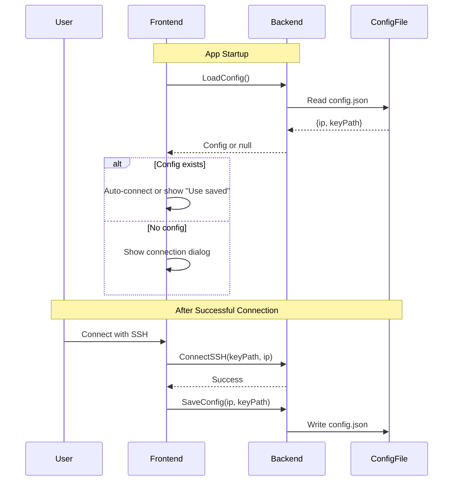

# Connection Configuration

## Overview

The reMarkable Template Manager implements persistent configuration storage to save connection details between application sessions. This allows users to configure their device connection once and automatically reconnect on subsequent launches without re-entering credentials.

**Key Features:**
- Automatic saving of successful connection details (IP address and SSH key path)
- Platform-specific configuration storage following OS conventions
- Secure storage (no passwords persisted)
- Quick reconnect functionality
- Manual configuration clearing

## Architecture

The configuration system follows a simple lifecycle:



### Component Responsibilities

**Backend (Go)**
- `config.go`: Core configuration management logic
  - Determines platform-specific config directory
  - Reads/writes JSON configuration file
  - Handles file permissions (0600 for security)
  - Validates configuration structure
- `app.go`: Exposes configuration methods to frontend via Wails
  - `LoadConfig()`: Loads saved configuration on startup
  - `SaveConfig(ip, keyPath)`: Saves connection details after successful connection
  - `DeleteConfig()`: Removes saved configuration
  - `GetConfigPath()`: Returns the config file path for debugging

**Frontend (React)**
- `Index.tsx`: Main page component
  - Loads config on component mount
  - Shows quick connect option if config exists
  - Saves config automatically after successful connection
  - Provides UI to clear saved configuration

## Configuration Storage

### File Location

Configuration is stored in platform-specific user directories following OS conventions:

| Platform | Directory |
|----------|-----------|
| **macOS** | `~/Library/Application Support/remarkable-template-manager/config.json` |
| **Windows** | `%APPDATA%\remarkable-template-manager\config.json` |
| **Linux** | `~/.config/remarkable-template-manager/config.json` |

The backend uses Go's `os.UserConfigDir()` to automatically determine the correct location for each platform.

### File Format

The configuration file uses JSON format for simplicity and native Go support:

```json
{
  "version": "1",
  "device": {
    "ip": "10.11.99.1",
    "sshKeyPath": "/Users/username/.ssh/remarkable"
  }
}
```

**Fields:**
- `version`: Configuration schema version (for future migrations)
- `device.ip`: IP address of the reMarkable device
- `device.sshKeyPath`: Absolute path to the SSH private key file

### Security Considerations

**What is stored:**
- ✅ Device IP address (non-sensitive)
- ✅ Path to SSH key file (reference only, not the key itself)

**What is NOT stored:**
- ❌ Device password (used only during key upload, then discarded)
- ❌ SSH private key contents (keys remain in `~/.ssh`)
- ❌ SSH session data

**File Permissions:**
- Configuration file is created with `0600` permissions (owner read/write only)
- Prevents other users from reading connection details
- Config directory is created with `0755` permissions

**Additional Security Notes:**
- SSH private keys remain in their original location (typically `~/.ssh`)
- Keys are never copied, moved, or duplicated by the application
- Password authentication (if used) never persists beyond the initial key upload
- Configuration file contains only references to existing credentials

## Usage

### Automatic Behavior

**First Launch (No Config):**
1. User clicks "Connect Device"
2. User selects/uploads SSH key and enters IP
3. Connection succeeds
4. Configuration is automatically saved

**Subsequent Launches (Config Exists):**
1. App loads saved configuration
2. User sees "Connect with saved settings" option
3. User can click to instantly reconnect
4. Or user can connect with different credentials (overwrites saved config)

### Manual Configuration Management

**Viewing Config Location:**
```typescript
const path = await GetConfigPath();
console.log("Config stored at:", path);
```

**Clearing Saved Configuration:**
```typescript
await DeleteConfig();
// User will need to reconnect from scratch
```

### Error Handling

The configuration system is designed to gracefully handle errors:

| Scenario | Behavior |
|----------|----------|
| Config file doesn't exist | Not an error; shows normal connection dialog |
| Config file is corrupted | Logs warning; ignores file; shows connection dialog |
| Config file has wrong permissions | Attempts to read anyway; warns in logs |
| SaveConfig fails | Warns user but doesn't disconnect |
| SSH key path in config no longer exists | Connection fails; user can reconnect with new key |

## Implementation Details

### Backend Data Structures

```go
type Config struct {
    Version string       `json:"version"`
    Device  DeviceConfig `json:"device"`
}

type DeviceConfig struct {
    IP         string `json:"ip"`
    SSHKeyPath string `json:"sshKeyPath"`
}
```

### Frontend Integration

The frontend uses Wails-generated bindings to call Go functions:

```typescript
import { LoadConfig, SaveConfig, DeleteConfig } from "wailsjs/go/main/App";

// On mount
useEffect(() => {
  LoadConfig().then(config => {
    if (config?.device) {
      setSavedConfig(config.device);
    }
  });
}, []);

// After successful connection
const handleSSHConnect = async (keyPath: string, ip: string) => {
  await ConnectSSH(keyPath, ip);
  await SaveConfig(ip, keyPath);
  // ... rest of connection logic
};
```

## Future Enhancements

Potential improvements for future versions:

1. **Multiple Device Profiles**: Support saving and switching between multiple reMarkable devices
2. **Auto-reconnect**: Automatically attempt reconnection if connection drops
3. **Config Migration**: Handle schema changes between versions
4. **Cloud Backup**: Optional backup of configuration to cloud storage
5. **SSH Key Management**: Generate and manage SSH keys from within the app
6. **Connection History**: Track and display connection history

## Troubleshooting

**Config not saving:**
- Check file permissions on the config directory
- Ensure sufficient disk space
- Check application logs for errors

**Config not loading:**
- Verify config file exists at the expected location (use `GetConfigPath()`)
- Check JSON syntax is valid
- Ensure file is readable by the application user

**SSH key path invalid:**
- Verify the SSH key still exists at the saved path
- Key may have been moved or deleted after saving config
- Use "Connect Device" to update with new key path

**Want to start fresh:**
- Use the "Clear Configuration" button in the UI
- Or manually delete the config file from the config directory
- Or click "Connect Device" to overwrite with new connection details
